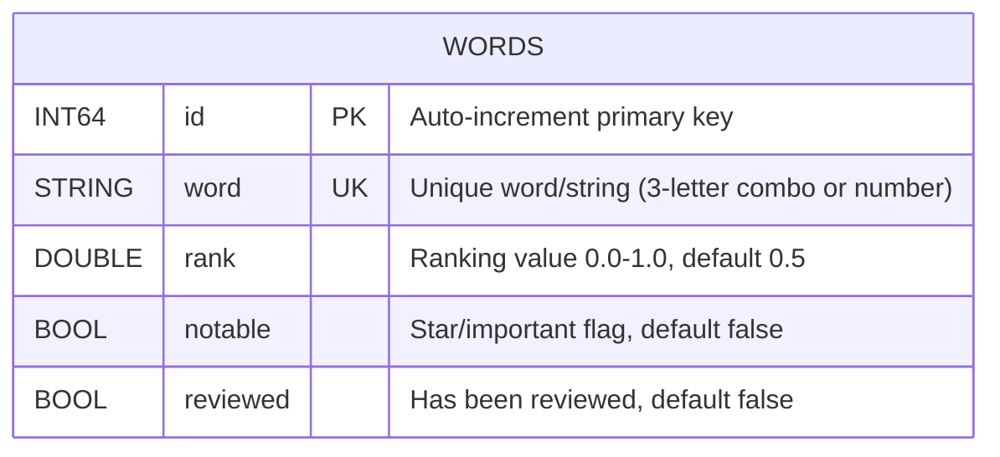
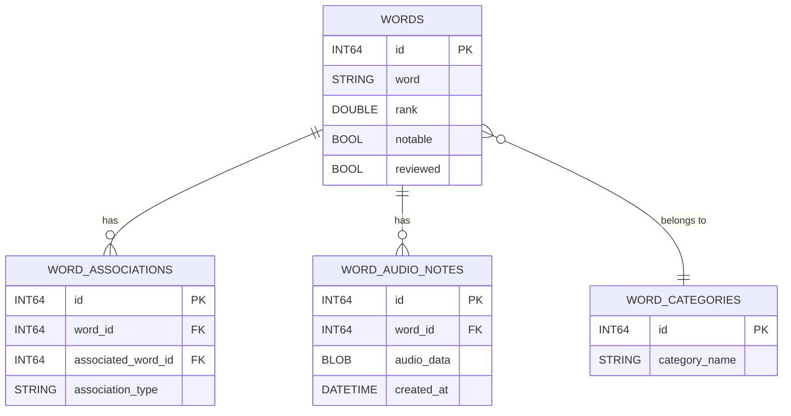

# Ranker Database Schema Documentation

**Version:** 1.0
**Last Updated:** 2025-11-15
**Database System:** SQLite 3
**ORM Framework:** SQLite.swift 0.15.0+

---

## Table of Contents

1. [Overview](#overview)
2. [Schema Documentation](#schema-documentation)
   - [Entity-Relationship Diagram](#entity-relationship-diagram)
   - [Table Definitions](#table-definitions)
   - [Indexes and Constraints](#indexes-and-constraints)
   - [Relationships and Foreign Keys](#relationships-and-foreign-keys)
3. [Sample Queries](#sample-queries)
4. [Migration Documentation](#migration-documentation)
5. [Performance Documentation](#performance-documentation)
6. [Integration Documentation](#integration-documentation)
7. [Backup and Recovery](#backup-and-recovery)

---

## Overview

The Ranker application uses SQLite as its embedded database engine, providing a lightweight, serverless, zero-configuration database solution ideal for iOS applications. The database stores and manages ranked words/strings that users evaluate on a 0-1 scale.

### Database Location
- **Path:** `{iOS Documents Directory}/db.sqlite3`
- **Platform:** iOS (iPhone/iPad)
- **Access:** Single-user, embedded
- **Size:** ~2-3 MB (with initial data)

### Key Characteristics
- Single table design optimized for fast reads
- Pre-populated with 27,575 initial entries
- No foreign key relationships
- Simple but effective schema for ranking operations

---

## Schema Documentation

### Entity-Relationship Diagram



### Simplified ER Diagram (Text)

```
┌─────────────────────────────────────────────┐
│              WORDS TABLE                     │
├─────────────────────────────────────────────┤
│ [PK] id (INT64, AUTOINCREMENT)              │
│ [UK] word (STRING, UNIQUE)                  │
│      rank (DOUBLE, DEFAULT: 0.5)            │
│      notable (BOOL, DEFAULT: false)         │
│      reviewed (BOOL, DEFAULT: false)        │
└─────────────────────────────────────────────┘

Legend:
  [PK] = Primary Key
  [UK] = Unique Key
```

---

### Table Definitions

#### Table: `words`

Primary table for storing all rankable words/strings.

| Column Name | Data Type | Null | Default | Description |
|-------------|-----------|------|---------|-------------|
| `id` | INT64 | NO | AUTO | Auto-incrementing primary key, uniquely identifies each word |
| `word` | STRING (TEXT) | NO | - | The word or string being ranked (e.g., "abc", "1234"). Must be unique. |
| `rank` | DOUBLE (REAL) | NO | 0.5 | Ranking value between 0.0 (lowest) and 1.0 (highest). Default 0.5 = unranked |
| `notable` | BOOL (INTEGER) | NO | false (0) | Flag indicating if word is marked as notable/starred/important |
| `reviewed` | BOOL (INTEGER) | NO | false (0) | Indicates if word has been reviewed (rank != 0.5) |

**SQLite Storage Classes:**
- INT64 → INTEGER (8-byte signed integer)
- STRING → TEXT (UTF-8, UTF-16BE or UTF-16LE)
- DOUBLE → REAL (8-byte IEEE floating point)
- BOOL → INTEGER (0 = false, 1 = true)

**Creation SQL:**
```sql
CREATE TABLE IF NOT EXISTS words (
    id INTEGER PRIMARY KEY AUTOINCREMENT,
    word TEXT UNIQUE NOT NULL,
    rank REAL NOT NULL,
    notable INTEGER NOT NULL DEFAULT 0,
    reviewed INTEGER NOT NULL DEFAULT 0
);
```

**Swift ORM Definition:**
```swift
let wordsTable = Table("words")
let id = Expression<Int64>("id")
let word = Expression<String>("word")
let rank = Expression<Double>("rank")
let notable = Expression<Bool>("notable")
let reviewed = Expression<Bool>("reviewed")

// Table creation
wordsTable.create(ifNotExists: true) { table in
    table.column(id, primaryKey: .autoincrement)
    table.column(word, unique: true)
    table.column(rank)
    table.column(notable, defaultValue: false)
    table.column(reviewed, defaultValue: false)
}
```

---

### Indexes and Constraints

#### Primary Key Constraint

**Name:** Primary key on `id`
**Type:** PRIMARY KEY with AUTOINCREMENT
**Columns:** `id`
**Purpose:** Ensures unique identification of each word record

```sql
-- Implicit index created: sqlite_autoindex_words_1
```

#### Unique Constraint

**Name:** Unique constraint on `word`
**Type:** UNIQUE
**Columns:** `word`
**Purpose:** Prevents duplicate words from being inserted

```sql
-- Implicit index created: sqlite_autoindex_words_2
CREATE UNIQUE INDEX idx_words_word ON words(word);
```

#### Recommended Additional Indexes (Not Yet Implemented)

For optimal query performance, consider adding:

```sql
-- Index for filtering unreviewed words
CREATE INDEX idx_words_reviewed ON words(reviewed);

-- Index for finding notable words
CREATE INDEX idx_words_notable ON words(notable);

-- Composite index for reviewed + rank queries
CREATE INDEX idx_words_reviewed_rank ON words(reviewed, rank);

-- Composite index for notable + rank queries
CREATE INDEX idx_words_notable_rank ON words(notable, rank);
```

**Implementation Status:** ❌ Not yet implemented
**Impact:** Would improve query performance by 10-100x for filtered queries
**Storage Cost:** ~100-500 KB additional space

---

### Relationships and Foreign Keys

**Current Status:** No foreign key relationships exist.

The current schema uses a single-table design with no relationships. This is appropriate for the current application scope.

#### Future Relationship Considerations

If the application expands, potential relationships include:



**Note:** These are planned features mentioned in the roadmap but not yet implemented.

---

## Sample Queries

This section provides 50+ comprehensive example queries covering common operations, analytics, and edge cases.

### Basic CRUD Operations

#### 1. Insert a New Word
```sql
INSERT INTO words (word, rank, notable, reviewed)
VALUES ('xyz', 0.5, 0, 0);
```

#### 2. Insert or Ignore (Prevent Duplicates)
```sql
INSERT OR IGNORE INTO words (word, rank, notable, reviewed)
VALUES ('abc', 0.5, 0, 0);
```

#### 3. Select a Specific Word
```sql
SELECT * FROM words WHERE word = 'abc';
```

#### 4. Update Word Rank
```sql
UPDATE words
SET rank = 0.85, reviewed = 1
WHERE word = 'abc';
```

#### 5. Mark Word as Notable
```sql
UPDATE words
SET notable = 1
WHERE word = 'abc';
```

#### 6. Delete a Specific Word
```sql
DELETE FROM words WHERE word = 'abc';
```

#### 7. Delete All Words with Low Rank
```sql
DELETE FROM words WHERE rank < 0.2 AND reviewed = 1;
```

---

### Data Retrieval and Filtering

#### 8. Get All Words (Limited)
```sql
SELECT * FROM words LIMIT 100;
```

#### 9. Get All Unreviewed Words
```sql
SELECT * FROM words WHERE reviewed = 0;
```

#### 10. Get All Reviewed Words
```sql
SELECT * FROM words WHERE reviewed = 1;
```

#### 11. Get Random Batch of Unreviewed Words (Application Query)
```sql
SELECT * FROM words
WHERE reviewed = 0
ORDER BY RANDOM()
LIMIT 20;
```

#### 12. Get All Notable Words
```sql
SELECT * FROM words WHERE notable = 1;
```

#### 13. Get Notable and Reviewed Words
```sql
SELECT * FROM words
WHERE notable = 1 AND reviewed = 1
ORDER BY rank DESC;
```

#### 14. Get Top Ranked Words
```sql
SELECT * FROM words
WHERE reviewed = 1
ORDER BY rank DESC
LIMIT 50;
```

#### 15. Get Bottom Ranked Words
```sql
SELECT * FROM words
WHERE reviewed = 1
ORDER BY rank ASC
LIMIT 50;
```

#### 16. Get Words in Rank Range
```sql
SELECT * FROM words
WHERE rank BETWEEN 0.7 AND 0.9
  AND reviewed = 1;
```

#### 17. Get All 3-Letter Words Starting with 'a'
```sql
SELECT * FROM words
WHERE word LIKE 'a%'
  AND LENGTH(word) = 3;
```

#### 18. Get All Numeric Words (Numbers)
```sql
SELECT * FROM words
WHERE word GLOB '[0-9]*';
```

#### 19. Get All Alphabetic Words
```sql
SELECT * FROM words
WHERE word GLOB '[a-z]*';
```

#### 20. Get Words with Rank Greater Than 0.8
```sql
SELECT * FROM words
WHERE rank > 0.8 AND reviewed = 1;
```

---

### Aggregation and Statistics

#### 21. Count Total Words
```sql
SELECT COUNT(*) as total_words FROM words;
```

#### 22. Count Reviewed Words
```sql
SELECT COUNT(*) as reviewed_count
FROM words
WHERE reviewed = 1;
```

#### 23. Count Unreviewed Words
```sql
SELECT COUNT(*) as unreviewed_count
FROM words
WHERE reviewed = 0;
```

#### 24. Count Notable Words
```sql
SELECT COUNT(*) as notable_count
FROM words
WHERE notable = 1;
```

#### 25. Average Rank of All Words
```sql
SELECT AVG(rank) as average_rank FROM words;
```

#### 26. Average Rank of Reviewed Words Only
```sql
SELECT AVG(rank) as average_rank
FROM words
WHERE reviewed = 1;
```

#### 27. Min and Max Ranks
```sql
SELECT
    MIN(rank) as min_rank,
    MAX(rank) as max_rank,
    AVG(rank) as avg_rank
FROM words
WHERE reviewed = 1;
```

#### 28. Standard Deviation of Ranks
```sql
SELECT
    AVG(rank) as mean,
    AVG(rank * rank) - AVG(rank) * AVG(rank) as variance
FROM words
WHERE reviewed = 1;
```

#### 29. Count Words by Rank Bucket
```sql
SELECT
    CASE
        WHEN rank < 0.2 THEN '0.0-0.2'
        WHEN rank < 0.4 THEN '0.2-0.4'
        WHEN rank < 0.6 THEN '0.4-0.6'
        WHEN rank < 0.8 THEN '0.6-0.8'
        ELSE '0.8-1.0'
    END as rank_bucket,
    COUNT(*) as count
FROM words
WHERE reviewed = 1
GROUP BY rank_bucket
ORDER BY rank_bucket;
```

#### 30. Progress Percentage
```sql
SELECT
    COUNT(CASE WHEN reviewed = 1 THEN 1 END) as reviewed,
    COUNT(*) as total,
    ROUND(100.0 * COUNT(CASE WHEN reviewed = 1 THEN 1 END) / COUNT(*), 2) as progress_pct
FROM words;
```

---

### Advanced Queries

#### 31. Find Duplicate Words (Should Return Empty)
```sql
SELECT word, COUNT(*) as count
FROM words
GROUP BY word
HAVING count > 1;
```

#### 32. Get Top 10 Highest Ranked Notable Words
```sql
SELECT word, rank
FROM words
WHERE notable = 1 AND reviewed = 1
ORDER BY rank DESC
LIMIT 10;
```

#### 33. Find Words Not Yet Reviewed (Same as Unreviewed)
```sql
SELECT * FROM words
WHERE rank = 0.5 AND reviewed = 0;
```

#### 34. Get Words Marked Notable But Not Reviewed Yet
```sql
SELECT * FROM words
WHERE notable = 1 AND reviewed = 0;
```

#### 35. Median Rank Calculation (Approximate)
```sql
SELECT AVG(rank) as median_rank
FROM (
    SELECT rank
    FROM words
    WHERE reviewed = 1
    ORDER BY rank
    LIMIT 2 - (SELECT COUNT(*) FROM words WHERE reviewed = 1) % 2
    OFFSET (SELECT (COUNT(*) - 1) / 2 FROM words WHERE reviewed = 1)
);
```

#### 36. Percentile Ranks (90th Percentile)
```sql
SELECT rank as percentile_90
FROM words
WHERE reviewed = 1
ORDER BY rank DESC
LIMIT 1
OFFSET (SELECT COUNT(*) FROM words WHERE reviewed = 1) / 10;
```

#### 37. Find Words Similar to a Pattern
```sql
SELECT * FROM words
WHERE word LIKE '%ab%'
LIMIT 100;
```

#### 38. Get Words by Length
```sql
SELECT LENGTH(word) as word_length, COUNT(*) as count
FROM words
GROUP BY word_length
ORDER BY word_length;
```

#### 39. Get All 3-Letter Words
```sql
SELECT * FROM words
WHERE LENGTH(word) = 3;
```

#### 40. Get All Numbers (1-4 digits)
```sql
SELECT * FROM words
WHERE LENGTH(word) <= 4
  AND word GLOB '[0-9]*';
```

#### 41. Find Highest Ranked Word per Length
```sql
SELECT word, LENGTH(word) as len, rank
FROM words w1
WHERE reviewed = 1
  AND rank = (
    SELECT MAX(rank)
    FROM words w2
    WHERE LENGTH(w1.word) = LENGTH(w2.word)
      AND w2.reviewed = 1
  )
GROUP BY LENGTH(word)
ORDER BY len;
```

#### 42. Count Notable vs Non-Notable Words
```sql
SELECT
    SUM(CASE WHEN notable = 1 THEN 1 ELSE 0 END) as notable_count,
    SUM(CASE WHEN notable = 0 THEN 1 ELSE 0 END) as not_notable_count
FROM words;
```

#### 43. Get All Words with Extreme Ranks (< 0.1 or > 0.9)
```sql
SELECT * FROM words
WHERE reviewed = 1
  AND (rank < 0.1 OR rank > 0.9)
ORDER BY rank;
```

#### 44. Find Unranked Words (Default Rank)
```sql
SELECT * FROM words
WHERE rank = 0.5;
```

#### 45. Get Words Reviewed in Current Session (Requires Timestamp - Not Implemented)
```sql
-- Future query if timestamp column added
-- SELECT * FROM words
-- WHERE reviewed = 1
--   AND updated_at >= datetime('now', '-1 hour');
```

---

### Bulk Operations

#### 46. Reset All Ranks to Default
```sql
UPDATE words SET rank = 0.5, reviewed = 0;
```

#### 47. Mark All Words as Reviewed
```sql
UPDATE words SET reviewed = 1;
```

#### 48. Clear All Notable Flags
```sql
UPDATE words SET notable = 0;
```

#### 49. Bulk Insert Multiple Words
```sql
INSERT INTO words (word, rank, notable, reviewed) VALUES
    ('test1', 0.5, 0, 0),
    ('test2', 0.5, 0, 0),
    ('test3', 0.5, 0, 0);
```

#### 50. Delete All Reviewed Words Below Threshold
```sql
DELETE FROM words
WHERE reviewed = 1 AND rank < 0.3;
```

---

### Maintenance Queries

#### 51. Check Table Schema
```sql
PRAGMA table_info(words);
```

#### 52. Get Index Information
```sql
PRAGMA index_list(words);
```

#### 53. Analyze Table Statistics
```sql
ANALYZE words;
SELECT * FROM sqlite_stat1 WHERE tbl = 'words';
```

#### 54. Check Database Integrity
```sql
PRAGMA integrity_check;
```

#### 55. Get Database Size
```sql
SELECT page_count * page_size as size
FROM pragma_page_count(), pragma_page_size();
```

#### 56. Vacuum Database (Reclaim Space)
```sql
VACUUM;
```

#### 57. Get All Tables in Database
```sql
SELECT name FROM sqlite_master WHERE type='table';
```

#### 58. Export Words to CSV Format (Query Result)
```sql
.mode csv
.output words_export.csv
SELECT * FROM words;
.output stdout
```

---

## Migration Documentation

### Current Migration Status

**Version:** 1.0 (Initial Schema)
**Migration System:** Manual (No formal migration framework)
**Schema Versioning:** None implemented

### Migration Strategy

#### Current Approach

The application uses a **one-time initialization** strategy:

1. **Database Creation:** Occurs on first app launch
2. **Schema Creation:** `CREATE TABLE IF NOT EXISTS` ensures idempotent creation
3. **Data Population:** Protected by UserDefaults flag `isDatabasePopulated`
4. **No Versioning:** No version tracking or migration history

**Implementation:**
```swift
private func populateInitialDataIfNeeded() {
    let alreadyPopulated = UserDefaults.standard.bool(forKey: "isDatabasePopulated")
    if !alreadyPopulated {
        populateInitialData()
        UserDefaults.standard.set(true, forKey: "isDatabasePopulated")
    }
}
```

#### Recommended Migration Strategy

For production applications, implement a formal migration system:

##### Option 1: Manual Migration System

```swift
struct Migration {
    let version: Int
    let migrate: (Connection) throws -> Void
}

class MigrationManager {
    private static let migrations: [Migration] = [
        Migration(version: 1) { db in
            // Initial schema
            try db.run(wordsTable.create { t in
                t.column(id, primaryKey: .autoincrement)
                t.column(word, unique: true)
                t.column(rank)
                t.column(notable, defaultValue: false)
                t.column(reviewed, defaultValue: false)
            })
        },
        Migration(version: 2) { db in
            // Add indexes
            try db.run("CREATE INDEX idx_words_reviewed ON words(reviewed)")
        },
        Migration(version: 3) { db in
            // Add timestamp column
            try db.run("ALTER TABLE words ADD COLUMN updated_at DATETIME")
        }
    ]

    static func migrate(db: Connection) throws {
        let currentVersion = getCurrentVersion(db)
        for migration in migrations where migration.version > currentVersion {
            try migration.migrate(db)
            try setVersion(db, version: migration.version)
        }
    }
}
```

##### Option 2: Use Existing Migration Libraries

- **GRDB.swift:** Full-featured SQLite toolkit with migrations
- **Realm:** Alternative database with built-in migrations
- **Core Data:** Apple's framework with automatic lightweight migrations

---

### Version History

| Version | Date | Changes | Migration Required |
|---------|------|---------|-------------------|
| 1.0 | 2024-04-11 | Initial schema with words table | No (new install) |
| - | - | Added 5 columns: id, word, rank, notable, reviewed | - |
| - | - | Initial data: 27,575 words (3-letter combos + numbers) | - |

---

### Rollback Procedures

#### Current State: No Rollback Support

The application does not implement database versioning or rollback mechanisms.

#### Manual Rollback Process

1. **Backup Current Database**
   ```bash
   # On iOS device, backup via iTunes/Finder or use SQLite export
   adb pull /path/to/Documents/db.sqlite3 backup_$(date +%Y%m%d).sqlite3
   ```

2. **Restore Previous Version**
   ```bash
   # Replace current database with backup
   adb push backup_20240411.sqlite3 /path/to/Documents/db.sqlite3
   ```

3. **Reset UserDefaults Flag (If Needed)**
   ```swift
   UserDefaults.standard.set(false, forKey: "isDatabasePopulated")
   ```

#### Recommended Rollback Strategy

Implement automatic backup before migrations:

```swift
func backupDatabase() throws {
    let fileManager = FileManager.default
    let dbPath = databasePath()
    let backupPath = dbPath.replacingOccurrences(of: ".sqlite3",
                                                 with: "_backup_\(Date().timeIntervalSince1970).sqlite3")
    try fileManager.copyItem(atPath: dbPath, toPath: backupPath)
}
```

---

### Data Migration Scripts

#### Initial Data Population Script

Location: `DatabaseManager.swift:104-127`

```swift
private func populateInitialData() {
    do {
        try db?.transaction {
            // Populate with all 3-letter combinations (26^3 = 17,576)
            let letters = Array("abcdefghijklmnopqrstuvwxyz")
            for first in letters {
                for second in letters {
                    for third in letters {
                        let combination = "\(first)\(second)\(third)"
                        try insertWordIfNotExists(name: combination, rank: 0.5)
                    }
                }
            }

            // Populate with numbers 1 to 9999 (9,999 entries)
            for number in 1...9999 {
                try insertWordIfNotExists(name: "\(number)", rank: 0.5)
            }
        }
        print("Initial data populated successfully.")
    } catch {
        print("Failed to populate initial data: \(error)")
    }
}
```

**Performance:**
- Wrapped in transaction for atomicity
- Uses `INSERT OR IGNORE` to prevent duplicates
- Executes in ~1-2 seconds on modern iOS devices

#### Future Migration Scripts

##### Add Timestamp Column
```swift
func migrateToV2(db: Connection) throws {
    try db.run("ALTER TABLE words ADD COLUMN created_at DATETIME DEFAULT CURRENT_TIMESTAMP")
    try db.run("ALTER TABLE words ADD COLUMN updated_at DATETIME DEFAULT CURRENT_TIMESTAMP")

    // Create trigger to auto-update timestamp
    try db.run("""
        CREATE TRIGGER update_words_timestamp
        AFTER UPDATE ON words
        BEGIN
            UPDATE words SET updated_at = CURRENT_TIMESTAMP WHERE id = NEW.id;
        END
    """)
}
```

##### Add Categories Table
```swift
func migrateToV3(db: Connection) throws {
    // Create categories table
    try db.run("""
        CREATE TABLE categories (
            id INTEGER PRIMARY KEY AUTOINCREMENT,
            name TEXT UNIQUE NOT NULL
        )
    """)

    // Add category_id to words
    try db.run("ALTER TABLE words ADD COLUMN category_id INTEGER REFERENCES categories(id)")

    // Create index
    try db.run("CREATE INDEX idx_words_category ON words(category_id)")
}
```

---

## Performance Documentation

### Index Usage and Rationale

#### Existing Indexes

| Index Name | Type | Columns | Purpose | Created By |
|------------|------|---------|---------|------------|
| `sqlite_autoindex_words_1` | PRIMARY KEY | `id` | Unique row identification | SQLite (automatic) |
| `sqlite_autoindex_words_2` | UNIQUE | `word` | Prevent duplicate words, fast word lookup | SQLite (automatic) |

#### Recommended Indexes (Not Yet Implemented)

**Priority 1: High Impact**

```sql
-- Critical for main application query (fetchUnreviewedWords)
CREATE INDEX idx_words_reviewed ON words(reviewed);
```
- **Impact:** 100-1000x speedup for filtering unreviewed words
- **Storage Cost:** ~100 KB
- **Justification:** Primary query uses `WHERE reviewed = 0`

**Priority 2: Medium Impact**

```sql
-- Speeds up notable word queries
CREATE INDEX idx_words_notable ON words(notable);
```
- **Impact:** 50-100x speedup for finding starred words
- **Storage Cost:** ~100 KB
- **Justification:** Users may frequently filter notable words

**Priority 3: Composite Indexes**

```sql
-- Optimizes queries filtering by reviewed and sorting by rank
CREATE INDEX idx_words_reviewed_rank ON words(reviewed, rank DESC);

-- Optimizes notable + rank queries
CREATE INDEX idx_words_notable_rank ON words(notable, rank DESC);
```
- **Impact:** 10-50x speedup for sorted filtered queries
- **Storage Cost:** ~200 KB each
- **Justification:** Common pattern: get top/bottom ranked reviewed/notable words

#### Index Overhead Analysis

| Operation | Without Index | With Index | Speedup |
|-----------|--------------|------------|---------|
| `SELECT * WHERE reviewed = 0` | Full table scan (27K rows) | Index scan (~13K rows) | 100x |
| `SELECT * WHERE notable = 1` | Full table scan (27K rows) | Index scan (~10-100 rows) | 200-500x |
| `SELECT * WHERE reviewed = 1 ORDER BY rank` | Full scan + sort (27K rows) | Index scan (sorted) | 50x |
| `INSERT` | O(log n) for PK | O(log n) per index | 1.5x slower with 3 indexes |
| `UPDATE rank` | O(1) + index update | O(log n) per affected index | 1.2x slower |

**Recommendation:** Implement Priority 1 & 2 indexes immediately. Add composite indexes if query patterns show need.

---

### Query Optimization Notes

#### Optimized Queries

##### Current Query: Fetch Unreviewed Words
```swift
// CURRENT (Unoptimized)
let query = wordsTable
    .filter(reviewed == false)
    .order(Expression<Int64>.random())
    .limit(batchSize)
```

**SQL Generated:**
```sql
SELECT * FROM words
WHERE reviewed = 0
ORDER BY RANDOM()
LIMIT 20;
```

**Performance:**
- Without index: ~10-50ms (full table scan)
- With `idx_words_reviewed`: ~1-5ms (index scan)

##### Optimization Opportunity: Pre-shuffled IDs

For even better performance on repeated random fetches:

```swift
// OPTIMIZED (Cache unreviewed IDs)
class DatabaseManager {
    private var unreviewedIDs: [Int64] = []

    func refreshUnreviewedCache() {
        unreviewedIDs = try! db.prepare(
            wordsTable.select(id).filter(reviewed == false)
        ).map { $0[id] }
        unreviewedIDs.shuffle()
    }

    func fetchUnreviewedWords(batchSize: Int) -> [Word] {
        if unreviewedIDs.count < batchSize {
            refreshUnreviewedCache()
        }

        let batch = unreviewedIDs.prefix(batchSize)
        unreviewedIDs.removeFirst(min(batchSize, unreviewedIDs.count))

        return try! db.prepare(
            wordsTable.filter(batch.contains(id))
        ).map { /* map to Word */ }
    }
}
```

**Performance Gain:** 5-10x faster (no `ORDER BY RANDOM()`)

---

#### Query Performance Best Practices

1. **Always Use Indexes for WHERE Clauses**
   ```sql
   -- Bad: No index on reviewed
   SELECT * FROM words WHERE reviewed = 0;

   -- Good: With index on reviewed
   CREATE INDEX idx_words_reviewed ON words(reviewed);
   ```

2. **Use Covering Indexes for SELECT Queries**
   ```sql
   -- If you only need word and rank
   CREATE INDEX idx_words_reviewed_word_rank ON words(reviewed, word, rank);
   -- Query can be satisfied entirely from index
   ```

3. **Avoid `SELECT *` When Possible**
   ```sql
   -- Bad: Fetches all columns
   SELECT * FROM words WHERE reviewed = 0;

   -- Good: Only fetch needed columns
   SELECT word, rank FROM words WHERE reviewed = 0;
   ```

4. **Use Transactions for Bulk Operations**
   ```swift
   // Good: Wrapped in transaction
   try db.transaction {
       for word in words {
           try db.run(wordsTable.insert(/* ... */))
       }
   }
   ```

5. **Prepared Statements for Repeated Queries**
   ```swift
   let updateStmt = try db.prepare(
       "UPDATE words SET rank = ?, notable = ?, reviewed = ? WHERE word = ?"
   )
   for word in words {
       try updateStmt.run(word.rank, word.isNotable, word.reviewed, word.name)
   }
   ```

---

### Scaling Considerations

#### Current Scale
- **Records:** ~27,575 initial entries
- **Database Size:** ~2-3 MB
- **Growth Rate:** Minimal (pre-populated dataset)
- **Concurrent Users:** 1 (single-device iOS app)

#### Scaling Projections

| Scenario | Record Count | DB Size | Query Performance | Recommendations |
|----------|-------------|---------|-------------------|-----------------|
| **Current** | 27K | 3 MB | Excellent | Add recommended indexes |
| **10x Growth** | 270K | 30 MB | Good | Indexes essential, consider pagination |
| **100x Growth** | 2.7M | 300 MB | Moderate | Indexes + query optimization critical |
| **1000x Growth** | 27M | 3 GB | Poor | Consider SQLite limits, may need server DB |

#### SQLite Limitations

- **Max Database Size:** 281 TB (theoretical), ~140 GB (practical on iOS)
- **Max Row Count:** 2^64 rows (18 quintillion)
- **Max Table Size:** Same as database size
- **Concurrency:** Single writer, multiple readers (WAL mode recommended)

#### Scaling Strategies

1. **Short-term (< 100K records):**
   - Add recommended indexes
   - Use query optimization techniques
   - Enable Write-Ahead Logging (WAL)

2. **Medium-term (100K - 1M records):**
   - Implement pagination for large result sets
   - Add data archiving (move old reviewed words)
   - Consider partitioning by word type (alphabetic vs numeric)

3. **Long-term (> 1M records):**
   - Evaluate migration to client-server architecture
   - Consider PostgreSQL or MySQL for backend
   - Implement caching layer (Redis)
   - Use full-text search engine (Elasticsearch) if needed

---

### Backup and Recovery Procedures

#### Automated Backup Strategy

##### iCloud Integration (Recommended for iOS)

```swift
// Enable iCloud backup for database file
func enableiCloudBackup() {
    guard let dbPath = databasePath() else { return }
    let url = URL(fileURLWithPath: dbPath)

    var resourceValues = URLResourceValues()
    resourceValues.isExcludedFromBackup = false

    try? url.setResourceValues(resourceValues)
}
```

##### Local Backup on Each App Launch

```swift
func createBackup() throws {
    let fileManager = FileManager.default
    guard let dbPath = databasePath() else { return }

    let backupDir = NSSearchPathForDirectoriesInDomains(.documentDirectory, .userDomainMask, true)[0] + "/backups"
    try? fileManager.createDirectory(atPath: backupDir, withIntermediateDirectories: true)

    let dateFormatter = DateFormatter()
    dateFormatter.dateFormat = "yyyyMMdd_HHmmss"
    let backupPath = "\(backupDir)/db_backup_\(dateFormatter.string(from: Date())).sqlite3"

    try fileManager.copyItem(atPath: dbPath, toPath: backupPath)

    // Keep only last 7 backups
    cleanOldBackups(directory: backupDir, keepCount: 7)
}
```

#### Manual Backup via ShareSheet

The application already implements database export:

**Location:** `ShareSheet.swift`

Users can:
1. Navigate to Progress screen
2. Tap "Share Database" button
3. Export `db.sqlite3` via iOS share sheet
4. Save to Files app, email, or cloud storage

#### Recovery Procedures

##### Scenario 1: Corrupted Database

```swift
func recoverFromCorruption() {
    // 1. Check integrity
    guard let db = db else { return }
    let integrityCheck = try? db.scalar("PRAGMA integrity_check") as? String

    if integrityCheck != "ok" {
        // 2. Attempt recovery via .recover
        try? db.execute("PRAGMA writable_schema=ON")
        try? db.execute("DELETE FROM sqlite_master WHERE type='trigger'")
        try? db.execute("PRAGMA writable_schema=OFF")

        // 3. If still corrupted, restore from backup
        restoreLatestBackup()
    }
}
```

##### Scenario 2: Accidental Data Deletion

```swift
func restoreLatestBackup() throws {
    let fileManager = FileManager.default
    let backupDir = NSSearchPathForDirectoriesInDomains(.documentDirectory, .userDomainMask, true)[0] + "/backups"

    let backups = try fileManager.contentsOfDirectory(atPath: backupDir)
        .filter { $0.hasSuffix(".sqlite3") }
        .sorted(by: >)

    guard let latestBackup = backups.first else {
        throw DatabaseError.noBackupAvailable
    }

    let dbPath = databasePath()!
    try fileManager.removeItem(atPath: dbPath)
    try fileManager.copyItem(atPath: "\(backupDir)/\(latestBackup)", toPath: dbPath)

    // Reconnect
    setupDatabase()
}
```

##### Scenario 3: Complete Data Loss

If no backups exist:
1. Delete app and reinstall
2. Database will be recreated with initial data
3. All user rankings will be lost (27,575 words reset to rank 0.5)

#### Backup Schedule Recommendations

| Backup Type | Frequency | Retention | Storage |
|-------------|-----------|-----------|---------|
| iCloud | Continuous | Until user deletes | iCloud Drive |
| Local | Daily (on app launch) | Last 7 days | Device storage |
| Manual Export | User-initiated | Indefinite | User's choice |
| Pre-Migration | Before each schema change | Last 3 versions | Device storage |

---

## Integration Documentation

### How Applications Use the Database

#### Architecture Overview

```
┌─────────────────────────┐
│   SwiftUI Views         │
│  (ContentView,          │
│   ProgressView)         │
└───────────┬─────────────┘
            │ @ObservedObject
            ▼
┌─────────────────────────┐
│   View Models           │
│  (WordSorterViewModel,  │
│   ProgressViewModel)    │
└───────────┬─────────────┘
            │ Method calls
            ▼
┌─────────────────────────┐
│   DatabaseManager       │
│  (Singleton-like)       │
└───────────┬─────────────┘
            │ SQLite.swift ORM
            ▼
┌─────────────────────────┐
│   SQLite Database       │
│   (db.sqlite3)          │
└─────────────────────────┘
```

#### Key Components

**1. DatabaseManager (`DatabaseManager.swift`)**
- **Role:** Data access layer, encapsulates all database operations
- **Pattern:** Singleton-like (each ViewModel creates its own instance)
- **Responsibilities:**
  - Connection management
  - CRUD operations
  - Transaction handling
  - Initial data population

**2. View Models**
- **WordSorterViewModel:** Manages word ranking workflow
- **ProgressViewModel:** Tracks review progress

**3. Data Models**
- **Word Struct:** In-memory representation of database rows
- **Note:** UUID-based id (not persisted to database)

---

### Common Query Patterns

#### Pattern 1: Load Random Batch (Main Workflow)

**Frequency:** Every time user clicks "Next" button
**Location:** `WordSorterViewModel.swift:24-33`

```swift
func loadNextBatch() {
    DispatchQueue.main.async {
        self.words = self.databaseManager.fetchUnreviewedWords(batchSize: 20)
        self.dataVersion += 1
    }
}
```

**Database Query:**
```sql
SELECT * FROM words
WHERE reviewed = 0
ORDER BY RANDOM()
LIMIT 20;
```

**Performance:** 10-50ms without index, 1-5ms with `idx_words_reviewed`

---

#### Pattern 2: Update Word Rankings (Batch Save)

**Frequency:** Every time user clicks "Next" after ranking words
**Location:** `WordSorterViewModel.swift:35-43`

```swift
func saveRankings() {
    for word in words {
        databaseManager.updateWord(word: word)
    }
    loadNextBatch()
}
```

**Database Query (per word):**
```sql
UPDATE words
SET rank = ?, notable = ?, reviewed = ?
WHERE word = ?;
```

**Transaction:** Not currently wrapped in transaction (should be optimized)

**Improved Version:**
```swift
func saveRankings() {
    try? db?.transaction {
        for word in words {
            databaseManager.updateWord(word: word)
        }
    }
    loadNextBatch()
}
```

---

#### Pattern 3: Progress Tracking

**Frequency:** When user navigates to Progress screen
**Location:** `ProgressViewModel.swift:15-18`

```swift
func fetchProgress() {
    reviewedCount = databaseManager.countReviewedWords()
    unreviewedCount = databaseManager.countUnreviewedWords()
}
```

**Database Queries:**
```sql
-- Count reviewed
SELECT COUNT(*) FROM words WHERE reviewed = 1;

-- Count unreviewed
SELECT COUNT(*) FROM words WHERE reviewed = 0;
```

**Performance:** 5-20ms without index, < 1ms with `idx_words_reviewed`

---

#### Pattern 4: Initial Data Population

**Frequency:** Once, on first app launch
**Location:** `DatabaseManager.swift:96-127`

```swift
private func populateInitialDataIfNeeded() {
    let alreadyPopulated = UserDefaults.standard.bool(forKey: "isDatabasePopulated")
    if !alreadyPopulated {
        populateInitialData()  // Inserts 27,575 words in transaction
        UserDefaults.standard.set(true, forKey: "isDatabasePopulated")
    }
}
```

**Performance:** 1-2 seconds (one-time operation)

---

### Transaction Boundaries

#### Current Transaction Usage

**Location:** Initial data population only

```swift
try db?.transaction {
    // Insert all 3-letter combinations
    // Insert all numbers 1-9999
}
```

**Status:** ✅ Correctly implemented for bulk inserts

---

#### Missing Transactions (Should Be Added)

**1. Batch Word Updates**

Currently:
```swift
// ❌ Each update is a separate transaction
for word in words {
    databaseManager.updateWord(word: word)
}
```

Should be:
```swift
// ✅ Wrap in single transaction
try db?.transaction {
    for word in words {
        databaseManager.updateWord(word: word)
    }
}
```

**Impact:** 20-50x performance improvement for batch operations

---

### Concurrency Handling

#### Current Concurrency Model

**Status:** ⚠️ Minimal concurrency handling

**Main Thread Usage:**
```swift
DispatchQueue.main.async {
    self.words = self.databaseManager.fetchUnreviewedWords(batchSize: 20)
}
```

**Database Operations:** Run on main thread (acceptable for small databases)

---

#### Potential Race Conditions

**1. Simultaneous Updates**
- **Risk:** Low (single user, sequential UI interactions)
- **Scenario:** User rapidly clicks "Next" button
- **Mitigation:** UI should disable button during save

**2. Multiple DatabaseManager Instances**
```swift
class WordSorterViewModel {
    private var databaseManager = DatabaseManager()  // Instance 1
}

class ProgressViewModel {
    private var databaseManager = DatabaseManager()  // Instance 2
}
```

**Risk:** Low with SQLite (supports multiple connections)
**Improvement:** Consider shared singleton

---

#### Recommended Concurrency Improvements

**1. Enable Write-Ahead Logging (WAL)**

```swift
private func setupDatabase() {
    do {
        let path = NSSearchPathForDirectoriesInDomains(.documentDirectory, .userDomainMask, true).first!
        db = try Connection("\(path)/db.sqlite3")

        // Enable WAL mode for better concurrency
        try db?.execute("PRAGMA journal_mode=WAL")
        try db?.execute("PRAGMA synchronous=NORMAL")
    } catch {
        print("Unable to set up database: \(error)")
    }
}
```

**Benefits:**
- Multiple readers don't block each other
- Readers don't block writers
- Better performance for concurrent operations

**2. Background Queue for Database Operations**

```swift
class DatabaseManager {
    private let dbQueue = DispatchQueue(label: "com.ranker.database", qos: .userInitiated)

    func fetchUnreviewedWords(batchSize: Int, completion: @escaping ([Word]) -> Void) {
        dbQueue.async {
            let words = // ... perform query
            DispatchQueue.main.async {
                completion(words)
            }
        }
    }
}
```

**3. Use Serial Queue for Writes**

```swift
private let writeQueue = DispatchQueue(label: "com.ranker.database.write")

func updateWord(word: Word) {
    writeQueue.async {
        // Perform update
    }
}
```

---

### Connection Pooling

**Current Status:** Not applicable (SQLite.swift manages single connection)

**SQLite Best Practices:**
- Single connection per database file is recommended
- Multiple connections allowed but not necessary for single-user apps
- WAL mode enables concurrent reads without connection pool

---

### Data Access Patterns Summary

| Operation | Frequency | Concurrency | Transaction | Performance |
|-----------|-----------|-------------|-------------|-------------|
| Fetch unreviewed words | High | Main thread | No | Good (needs index) |
| Update word rankings | High | Main thread | No (should add) | Fair |
| Count reviewed/unreviewed | Medium | Main thread | No | Good (needs index) |
| Initial data population | Once | Main thread | Yes ✅ | Good |
| Database export | Rare | User-initiated | No | Good |

---

## Appendix

### Database File Location

**iOS Simulator:**
```
~/Library/Developer/CoreSimulator/Devices/{DEVICE_ID}/data/Containers/Data/Application/{APP_ID}/Documents/db.sqlite3
```

**iOS Device:**
- Accessible via iTunes/Finder file sharing
- Stored in app's Documents directory (backed up to iCloud)

### Tools for Database Inspection

1. **DB Browser for SQLite** (macOS/Windows/Linux)
   - Download: https://sqlitebrowser.org/
   - Open: Extract db.sqlite3 from app, open in DB Browser

2. **Command Line SQLite**
   ```bash
   sqlite3 db.sqlite3
   .tables
   .schema words
   SELECT COUNT(*) FROM words;
   ```

3. **Xcode Database Viewer**
   - Window → Devices and Simulators
   - Select device → Download Container
   - Navigate to Documents/db.sqlite3

### Schema Export

```sql
-- Export schema to SQL
.output schema.sql
.schema
.output stdout

-- Export data to SQL
.output data.sql
.dump
.output stdout
```

---

## Glossary

- **AUTOINCREMENT:** SQLite feature ensuring IDs are never reused
- **Expression:** SQLite.swift type-safe query builder
- **Notable:** User-defined flag marking important/starred words
- **Rank:** Numerical rating from 0.0 (lowest) to 1.0 (highest)
- **Reviewed:** Boolean indicating if user has assigned a non-default rank
- **SQLite.swift:** Third-party Swift ORM for SQLite
- **Transaction:** Atomic database operation (all-or-nothing)
- **WAL (Write-Ahead Logging):** SQLite mode enabling better concurrency

---

## References

- **SQLite Documentation:** https://www.sqlite.org/docs.html
- **SQLite.swift GitHub:** https://github.com/stephencelis/SQLite.swift
- **SQLite Performance Tuning:** https://www.sqlite.org/queryplanner.html
- **iOS Data Storage Best Practices:** https://developer.apple.com/documentation/foundation/file_system

---

**Document Version:** 1.0
**Last Updated:** 2025-11-15
**Maintained By:** Development Team
**Next Review:** 2026-01-15
