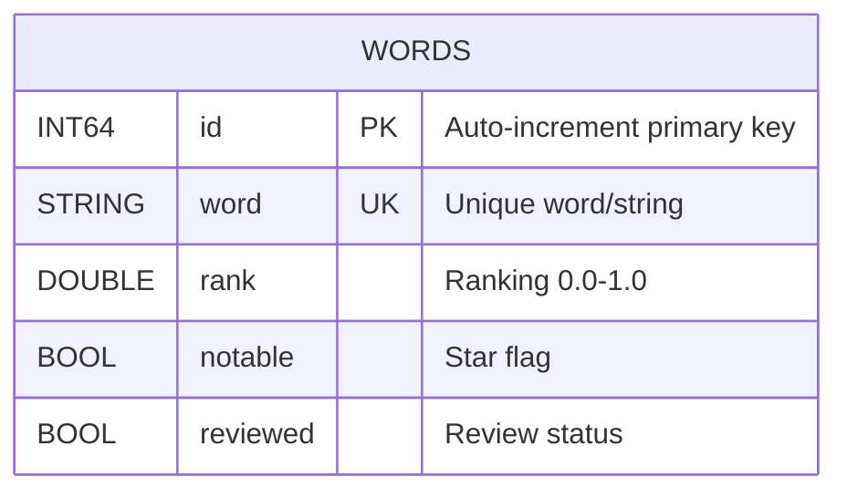
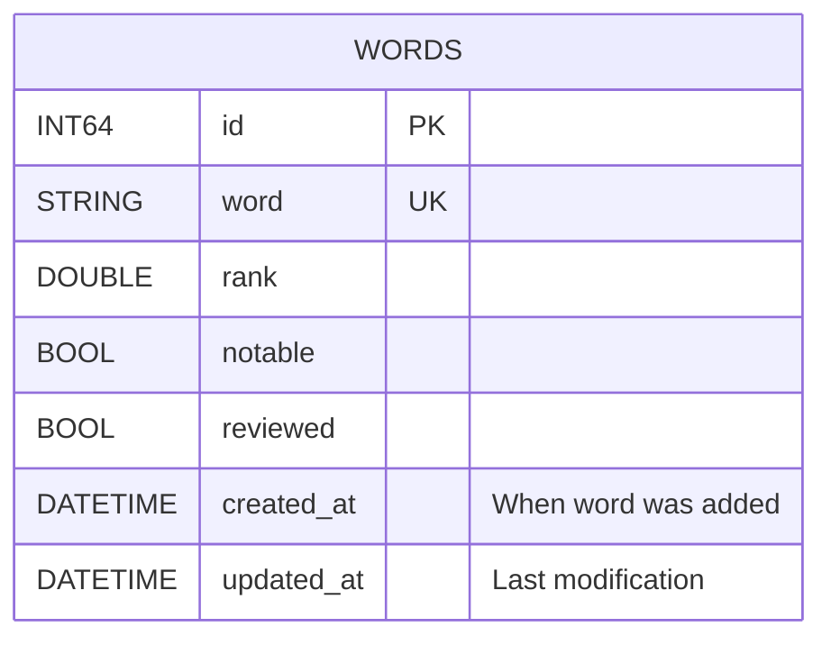
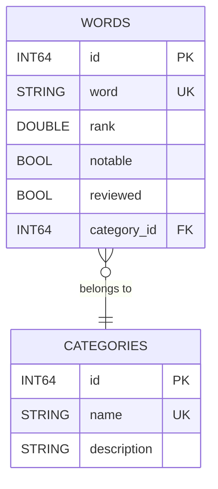
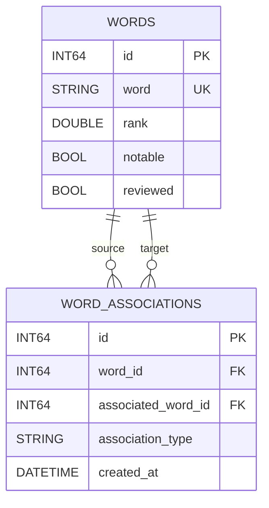
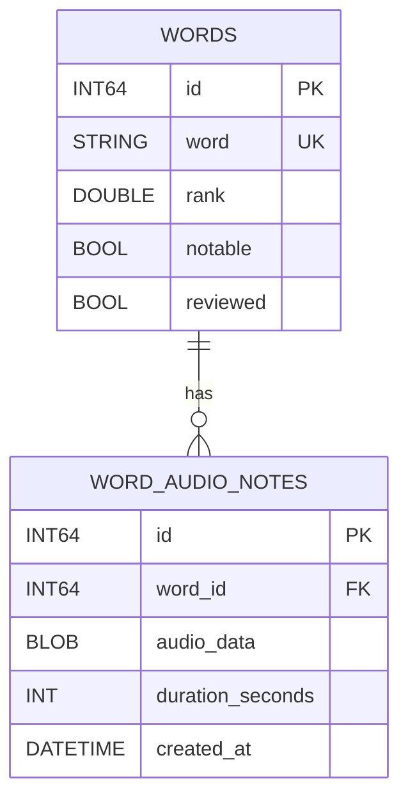
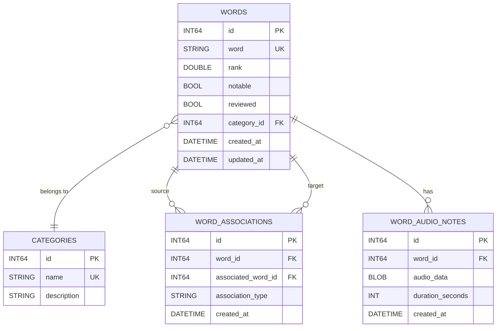

# Ranker Database - Entity-Relationship Diagrams

**Version:** 1.0
**Last Updated:** 2025-11-15
**Database:** SQLite 3

---

## Table of Contents

1. [Current Schema ER Diagram](#current-schema-er-diagram)
2. [Detailed Table Structure](#detailed-table-structure)
3. [Future Schema Proposals](#future-schema-proposals)
4. [Data Flow Diagrams](#data-flow-diagrams)

---

## Current Schema ER Diagram

### Primary ER Diagram (Mermaid)



### Detailed ASCII ER Diagram

```
┌───────────────────────────────────────────────────────────────┐
│                        WORDS TABLE                            │
├───────────────────────────────────────────────────────────────┤
│                                                               │
│  ┌─────────────────────────────────────────────────────┐     │
│  │ Column: id                                          │     │
│  │ Type:    INT64 (INTEGER in SQLite)                  │     │
│  │ Constraint: PRIMARY KEY AUTOINCREMENT               │     │
│  │ Purpose: Unique identifier for each word            │     │
│  │ Range:   1 to 9,223,372,036,854,775,807            │     │
│  └─────────────────────────────────────────────────────┘     │
│                          ↓                                    │
│  ┌─────────────────────────────────────────────────────┐     │
│  │ Column: word                                        │     │
│  │ Type:    STRING (TEXT in SQLite)                    │     │
│  │ Constraint: UNIQUE, NOT NULL                        │     │
│  │ Purpose: The actual word/string being ranked        │     │
│  │ Examples: "abc", "xyz", "123", "9999"              │     │
│  │ Length:  Typically 1-4 characters                   │     │
│  └─────────────────────────────────────────────────────┘     │
│                          ↓                                    │
│  ┌─────────────────────────────────────────────────────┐     │
│  │ Column: rank                                        │     │
│  │ Type:    DOUBLE (REAL in SQLite)                    │     │
│  │ Constraint: NOT NULL                                │     │
│  │ Purpose: User's ranking of the word                 │     │
│  │ Range:   0.0 (lowest) to 1.0 (highest)             │     │
│  │ Default: 0.5 (unranked)                            │     │
│  └─────────────────────────────────────────────────────┘     │
│                          ↓                                    │
│  ┌─────────────────────────────────────────────────────┐     │
│  │ Column: notable                                     │     │
│  │ Type:    BOOL (INTEGER 0/1 in SQLite)              │     │
│  │ Constraint: NOT NULL, DEFAULT 0                     │     │
│  │ Purpose: Star/favorite flag for important words     │     │
│  │ Values:  0 = not notable, 1 = notable              │     │
│  └─────────────────────────────────────────────────────┘     │
│                          ↓                                    │
│  ┌─────────────────────────────────────────────────────┐     │
│  │ Column: reviewed                                    │     │
│  │ Type:    BOOL (INTEGER 0/1 in SQLite)              │     │
│  │ Constraint: NOT NULL, DEFAULT 0                     │     │
│  │ Purpose: Indicates if word has been reviewed        │     │
│  │ Logic:   Set to 1 when rank != 0.5                 │     │
│  │ Values:  0 = unreviewed, 1 = reviewed              │     │
│  └─────────────────────────────────────────────────────┘     │
│                                                               │
└───────────────────────────────────────────────────────────────┘

Indexes:
  [1] sqlite_autoindex_words_1 → PRIMARY KEY (id)
  [2] sqlite_autoindex_words_2 → UNIQUE (word)
```

---

## Detailed Table Structure

### Column Relationships and Dependencies

```
                    ┌─────────────┐
                    │   word      │ ← User input (unique identifier)
                    │  (STRING)   │
                    └──────┬──────┘
                           │
                           ▼
                    ┌─────────────┐
                    │    rank     │ ← User's rating
                    │  (DOUBLE)   │
                    └──────┬──────┘
                           │
                ┌──────────┴──────────┐
                ▼                     ▼
         ┌─────────────┐      ┌─────────────┐
         │  reviewed   │      │  notable    │ ← User flags
         │   (BOOL)    │      │   (BOOL)    │
         └─────────────┘      └─────────────┘
                │                     │
                └──────────┬──────────┘
                           ▼
                    Derived from user interaction

Logic Flow:
  1. User sees word from database (unreviewed = 0)
  2. User assigns rank (0.0 - 1.0) via slider
  3. User optionally marks as notable (star icon)
  4. On save:
     - rank is stored
     - notable is stored
     - reviewed = 1 if rank != 0.5
```

---

### Data Type Mappings

```
┌──────────────────────────────────────────────────────────┐
│        Swift ↔ SQLite.swift ↔ SQLite                    │
├──────────────────────────────────────────────────────────┤
│                                                          │
│  Int64  →  Expression<Int64>  →  INTEGER (8 bytes)      │
│  String →  Expression<String> →  TEXT (UTF-8)           │
│  Double →  Expression<Double> →  REAL (8-byte float)    │
│  Bool   →  Expression<Bool>   →  INTEGER (0 or 1)       │
│                                                          │
└──────────────────────────────────────────────────────────┘

Storage Sizes:
  - INT64:  8 bytes (fixed)
  - STRING: Variable (1-4 bytes per char in UTF-8)
  - DOUBLE: 8 bytes (fixed)
  - BOOL:   1 byte (stored as INTEGER)

Example Row Size:
  id:       8 bytes
  word:     4 bytes (avg 3-4 chars)
  rank:     8 bytes
  notable:  1 byte
  reviewed: 1 byte
  ─────────────────
  Total:    ~22 bytes per row (+ overhead)

27,575 rows ≈ 606,650 bytes ≈ 592 KB (data only)
With indexes & overhead: ~2-3 MB
```

---

## Future Schema Proposals

### Proposal 1: Add Timestamps



**ASCII Diagram:**
```
┌────────────────────────────────────┐
│          WORDS (v2)                │
├────────────────────────────────────┤
│  id           INT64    PK          │
│  word         STRING   UK          │
│  rank         DOUBLE                │
│  notable      BOOL                  │
│  reviewed     BOOL                  │
│  created_at   DATETIME [NEW]       │ ← Track creation
│  updated_at   DATETIME [NEW]       │ ← Track last update
└────────────────────────────────────┘

Migration SQL:
  ALTER TABLE words ADD COLUMN created_at DATETIME DEFAULT CURRENT_TIMESTAMP;
  ALTER TABLE words ADD COLUMN updated_at DATETIME DEFAULT CURRENT_TIMESTAMP;
```

---

### Proposal 2: Add Categories



**ASCII Diagram:**
```
┌─────────────────────────┐          ┌─────────────────────────┐
│    CATEGORIES           │          │      WORDS              │
├─────────────────────────┤          ├─────────────────────────┤
│  id      INT64    PK    │◄─────────│  id          INT64  PK  │
│  name    STRING   UK    │   Many   │  word        STRING UK  │
│  desc    STRING         │    to    │  rank        DOUBLE     │
└─────────────────────────┘   One    │  notable     BOOL       │
                                      │  reviewed    BOOL       │
Examples:                             │  category_id INT64  FK  │
  - 3-letter combos                   └─────────────────────────┘
  - Numbers
  - Custom words                      Foreign Key Relationship:
  - Common words                        words.category_id → categories.id
```

---

### Proposal 3: Add Word Associations



**ASCII Diagram:**
```
┌──────────────────────┐         ┌────────────────────────────┐
│      WORDS           │         │   WORD_ASSOCIATIONS        │
├──────────────────────┤         ├────────────────────────────┤
│  id      INT64   PK  │◄───────┐│  id                 PK     │
│  word    STRING  UK  │        ││  word_id            FK ────┼──┐
│  rank    DOUBLE      │        ││  associated_word_id FK     │  │
│  notable BOOL        │        │└────────────────────────────┘  │
│  reviewed BOOL       │        │                                │
└──────────────────────┘        └────────────────────────────────┘

Examples:
  word_id=123 (word="abc") associated_with word_id=456 (word="xyz")
  association_type = "similar", "rhymes", "related", "opposite"
```

---

### Proposal 4: Add Audio Notes



**ASCII Diagram:**
```
┌──────────────────────┐         ┌────────────────────────────┐
│      WORDS           │         │   WORD_AUDIO_NOTES         │
├──────────────────────┤         ├────────────────────────────┤
│  id      INT64   PK  │◄────────│  id                 PK     │
│  word    STRING  UK  │   1:N   │  word_id            FK     │
│  rank    DOUBLE      │         │  audio_data         BLOB   │
│  notable BOOL        │         │  duration_seconds   INT    │
│  reviewed BOOL       │         │  created_at         DATETIME│
└──────────────────────┘         └────────────────────────────┘

Use Case:
  - User records audio note about why they ranked a word
  - Audio stored as BLOB (M4A, AAC, etc.)
  - Duration tracked for UI display
```

---

### Complete Future Schema (All Proposals)



---

## Data Flow Diagrams

### Current Application Data Flow

```
┌──────────────────────────────────────────────────────────────┐
│                  USER INTERACTION FLOW                        │
└──────────────────────────────────────────────────────────────┘

1. APP LAUNCH
   │
   ├─→ DatabaseManager.init()
   │   └─→ setupDatabase() → Connect to db.sqlite3
   │       └─→ createWordsTable() → CREATE TABLE IF NOT EXISTS
   │           └─→ populateInitialDataIfNeeded()
   │               └─→ Check UserDefaults["isDatabasePopulated"]
   │                   ├─→ If false: populateInitialData()
   │                   │   └─→ INSERT 27,575 words (in transaction)
   │                   └─→ If true: Skip
   │
   ▼
2. MAIN SCREEN LOAD
   │
   ├─→ WordSorterViewModel.init()
   │   └─→ loadNextBatch()
   │       └─→ DatabaseManager.fetchUnreviewedWords(20)
   │           └─→ SELECT * FROM words WHERE reviewed=0
   │               ORDER BY RANDOM() LIMIT 20
   │
   ▼
3. USER RANKS WORDS
   │
   ├─→ User adjusts sliders (rank 0.0-1.0)
   ├─→ User taps stars (notable = true)
   │
   ▼
4. USER CLICKS "NEXT"
   │
   ├─→ WordSorterViewModel.saveRankings()
   │   ├─→ For each word in batch:
   │   │   └─→ DatabaseManager.updateWord(word)
   │   │       └─→ UPDATE words SET rank=?, notable=?, reviewed=?
   │   │           WHERE word=?
   │   └─→ loadNextBatch() → Repeat step 2
   │
   ▼
5. USER VIEWS PROGRESS
   │
   └─→ ProgressViewModel.fetchProgress()
       ├─→ countReviewedWords()
       │   └─→ SELECT COUNT(*) FROM words WHERE reviewed=1
       └─→ countUnreviewedWords()
           └─→ SELECT COUNT(*) FROM words WHERE reviewed=0
```

---

### Database Write Flow

```
┌──────────────────────────────────────────────────────────────┐
│                    WRITE OPERATION FLOW                       │
└──────────────────────────────────────────────────────────────┘

User Action
    │
    ▼
┌─────────────────────┐
│   UI Layer          │  WordSorterContentView
│   (SwiftUI)         │  - Slider changes
│                     │  - Star taps
└──────────┬──────────┘
           │
           ▼
┌─────────────────────┐
│  ViewModel Layer    │  WordSorterViewModel
│  (@Published)       │  - words: [Word]
│                     │  - saveRankings()
└──────────┬──────────┘
           │
           ▼
┌─────────────────────┐
│  Data Access Layer  │  DatabaseManager
│  (SQLite.swift)     │  - updateWord(word: Word)
│                     │
└──────────┬──────────┘
           │
           ▼
┌─────────────────────┐
│  ORM Layer          │  SQLite.swift Expression Builder
│                     │  - wordsTable.filter(word == name)
│                     │  - .update(rank <- value)
└──────────┬──────────┘
           │
           ▼
┌─────────────────────┐
│  SQLite Engine      │  db.sqlite3
│                     │  - Parse SQL
│                     │  - Acquire locks
│                     │  - Write to disk
│                     │  - Update indexes
└─────────────────────┘
```

---

### Read vs Write Paths

```
READ PATH (Fast)                    WRITE PATH (Slower)
─────────────────                   ────────────────────

ViewModel                           ViewModel
    │                                   │
    ▼                                   ▼
DatabaseManager                     DatabaseManager
    │                                   │
    ▼                                   ▼
SELECT query                        UPDATE query
    │                                   │
    ▼                                   ▼
Index lookup (if available)         Row lookup via index
    │                                   │
    ▼                                   ▼
Read from disk cache                Lock row
    │                                   │
    ▼                                   ▼
Return results                      Write to journal
                                        │
                                        ▼
                                    Update indexes
                                        │
                                        ▼
                                    Commit transaction
                                        │
                                        ▼
                                    Return success

Timing: 1-10ms                      Timing: 5-20ms (per row)
```

---

### Transaction Flow (Initial Data Population)

```
┌──────────────────────────────────────────────────────────────┐
│            TRANSACTION: Initial Data Population               │
└──────────────────────────────────────────────────────────────┘

START
  │
  ├─→ BEGIN TRANSACTION
  │   │
  │   ├─→ For first in 'a'..'z'
  │   │   └─→ For second in 'a'..'z'
  │   │       └─→ For third in 'a'..'z'
  │   │           └─→ INSERT OR IGNORE INTO words VALUES (...)
  │   │               (17,576 iterations)
  │   │
  │   ├─→ For number in 1..9999
  │   │   └─→ INSERT OR IGNORE INTO words VALUES (...)
  │   │       (9,999 iterations)
  │   │
  │   └─→ COMMIT TRANSACTION
  │
  └─→ END

Benefits of Transaction:
  ✓ Atomicity: All-or-nothing (if crash occurs, no partial data)
  ✓ Performance: ~50x faster than individual INSERTs
  ✓ Consistency: Database never in inconsistent state

Without Transaction:  ~60-90 seconds
With Transaction:     ~1-2 seconds
```

---

## Index Visualization

### Current Indexes

```
┌───────────────────────────────────────────────────────────────┐
│                  INDEX: PRIMARY KEY (id)                       │
└───────────────────────────────────────────────────────────────┘

B-Tree Structure:

                    [10000]
                   /       \
              [5000]       [15000]
             /     \       /      \
        [2500]  [7500] [12500]  [17500]
         ...     ...     ...      ...

Leaf nodes contain: (id, row_pointer)
Lookup complexity: O(log n) ≈ 15 comparisons for 27K rows
```

```
┌───────────────────────────────────────────────────────────────┐
│              INDEX: UNIQUE (word)                              │
└───────────────────────────────────────────────────────────────┘

B-Tree Structure (alphabetical):

                  ["m"]
                 /     \
             ["f"]     ["t"]
            /    \     /    \
        ["c"]  ["i"]["p"]["w"]
         ...    ...  ...  ...

Leaf nodes contain: (word_string, row_pointer)
Lookup complexity: O(log n) ≈ 15 comparisons for 27K rows
Enables: Fast word uniqueness check during INSERT
```

---

### Proposed Indexes (Performance Boost)

```
┌───────────────────────────────────────────────────────────────┐
│           INDEX: idx_words_reviewed (reviewed)                 │
└───────────────────────────────────────────────────────────────┘

B-Tree Structure (boolean):

                [0 or 1]
               /        \
       [0: ~13K rows]  [1: ~14K rows]
         (unreviewed)    (reviewed)

Benefits:
  - Query: WHERE reviewed = 0 → Direct to left branch
  - Speedup: 100-1000x (avoids full table scan)
  - Storage: ~100 KB

Example Query Performance:
  SELECT * FROM words WHERE reviewed = 0 LIMIT 20;

  Without index: Scan 27,575 rows → ~50ms
  With index:    Scan ~13,788 rows from index → ~1ms
```

---

## Summary Statistics

### Current Schema Metrics

```
┌─────────────────────────────────────────────────────────┐
│                 DATABASE STATISTICS                      │
├─────────────────────────────────────────────────────────┤
│                                                          │
│  Tables:                    1 (words)                   │
│  Total Rows:                27,575                      │
│  Total Columns:             5                           │
│  Indexes:                   2 (PK + unique)             │
│  Foreign Keys:              0                           │
│  Triggers:                  0                           │
│  Views:                     0                           │
│                                                          │
│  Database Size:             ~2-3 MB                     │
│  Data Size:                 ~592 KB                     │
│  Index Size:                ~400 KB                     │
│  Overhead:                  ~1-2 MB                     │
│                                                          │
│  Estimated Growth:          Minimal (pre-populated)     │
│  Write Operations:          ~20 per user session        │
│  Read Operations:           ~100 per user session       │
│                                                          │
└─────────────────────────────────────────────────────────┘
```

---

**Document Version:** 1.0
**Last Updated:** 2025-11-15
**Related Documents:**
- [DATABASE_DOCUMENTATION.md](DATABASE_DOCUMENTATION.md)
- [MIGRATION_GUIDE.md](MIGRATION_GUIDE.md)
- [PERFORMANCE_GUIDE.md](PERFORMANCE_GUIDE.md)
